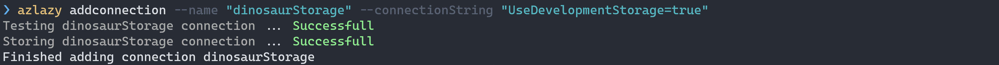

AzLazy CLI tool is designed for developers, it provides a command line interface to quickly manage and make changes to azure storage queues, blobs and tables.

# Table of Contents
1. [Installation](#installation)
2. [Getting started](#gettingstarted)
3. [Command list](#commandlist)
    1. [Connection Commands](#connectioncommand)
    2. [Queue Commands](#queuecommand)
    3. [Container Commands](#containercommand)
4. [Contributing](#contributing)
5. [Change Log](#changelog)

# 1. Installation 

You can download the tool from the [Nuget Gallery](https://www.nuget.org/packages/az-lazy/), run the following installation command,

`dotnet tool install --global az-lazy`

# 2. Getting started 

Use the following command to add a new connection

`azlazy addconnection --name "dinosaurStorage" --connectionString "<<azure access key>>"`

Select the connection you want to use

`azlazy connection --select "dinosaurStorage"`

You can check which connection is selected the the list command, by default you will always have **devStorage** which allows you to connect to a local azure emulator

`azlazy connection --list`

Once a connection has been added you can begin using all the other commands, eg

`azlazy queue --list`

`azlazy queue --watch "process-carnivores"`

`azlazy queue --peek "process-carnivores" --peekCount 3`

# 3. Command List 

To view a list of commands through the CLI you can use `azlazy --help`, each command has an alias beginning with the first letter of the command, eg `azlazy connection --list` can be aliased to `azlazy connection -l`.

## i. Connection commands 

| Command   |      Description      |
|--------------|:-------------|
| `azlazy addconnection --name "name of connection" --connectionstring "connection string"` |  Adds a new connection to the connection list. You can also select the connection with `--select true` |
| `azlazy connection --help` | Display a list of commends you can use for connections   |
| `azlazy connection --list` | Show a list of connections available, the selected connection will highlighted with a `[*]` symbol |
| `azlazy connection --remove "name of connection"` | Removes a connection from the connections list |
| `azlazy connection --select "name of connection"` | Selects a connection from the connections list |

## ii. Queue commands 

| Command   |      Description      |
|--------------|:-------------|
| `azlazy addqueue --name "queue to add"` |  Creates a new queue with the given name |
| `azlazy queue --list` |  View a list of queues in the storage account along with the number of messages they are holding, poison queues are highlighted in red |
| `azlazy queue --remove "queue to remove"` | Removes the queue with the given name |
| `azlazy queue --cure "queue to move poison messages to"` | Moves poison queue messages back into the processing queue |
| `azlazy queue --clear "queue to clear"` | Removes all messages in the queue |
| `azlazy queue --addQueue "queue to add a new message" --addMessage '{ \"test\": true }'` | Adds a new message to the queue |
| `azlazy queue --watch "queue to watch"` | Watches a queue for new messages |
| `azlazy queue --peek "queue to peek messages"` | Views messages in the queue, note this function peeks messages so visibility is not changed for consuming applications. `--peekCount 10` can also be used to specify how many messages you want to view. The Maximum peek count available is 32.  |
| `azlazy queue --from "source queue name" --to "destination queue name"` | Moves queue messages from the source queue to a destination queue |
 

## iii. Container commands 

| Command   |      Description      |
|--------------|:-------------|
| `azlazy container --list` | View a list of containers in the storage account, along with whether or not its public and when it was last modified |

More coming soon !

# 4. Contributing 

I haven't written any contributing guidelines yet but you can reach me here on [Faesel.com contact page](https://www.faesel.com/contact). [Development Notes](documentation/contributing.md) are also available.

# 5. Change Log 

| Date Released   |      Version      |      Description      |
|----------|:-------------|:-------------|
| 23/10/2020 | v1.0.0 | Added command to create a new queue |
| 24/10/2020 | v1.0.1 | Added message counts to queue list, and coloured poison queues in red |
| 25/10/2020 | v1.0.2 | Added command to remove a queue |
| 27/10/2020 | v1.0.3 | Added command to move poison queue messages back into the processing queue |
| 27/10/2020 | v1.0.4 | Added command to clear queue, bug fix on messaging |
| 27/10/2020 | v1.0.5 | Added command to add a new message to the queue |
| 29/10/2020 | v1.0.6 | Added command to watch a queue message |
| 29/10/2020 | v1.0.7 | Bug Fix, resolved problem of package storing data in current directory rather than using the package directory |
| 30/10/2020 | v1.0.8 | Added command to peek for messages in a queue |
| 31/10/2020 | v1.0.8 | Added support to display queue messages in both base64 and utf8 format |
| 31/10/2020 | v1.0.9 | Added some stability fixes |
| 01/11/2020 | v1.1.0 | Added command to move messages from one queue to another |
| 04/11/2020 | v1.1.1 | Added a fix for printing out multiline JSON |
| 06/11/2020 | v1.1.2 | Added command to list containers |
